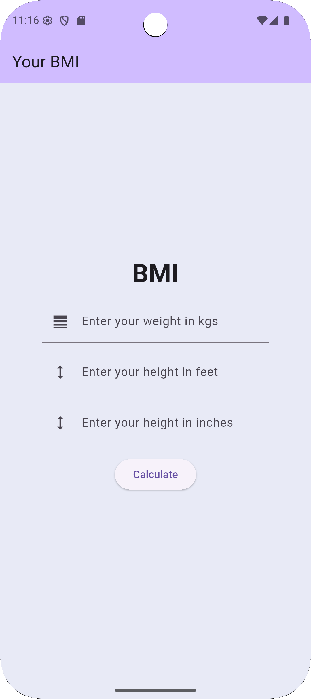
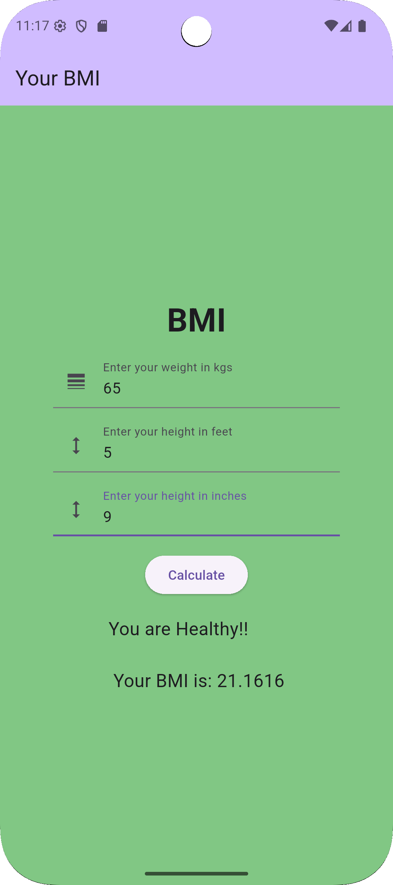

📱 BMI Calculator App
A simple and user-friendly Flutter application that calculates Body Mass Index (BMI) based on height and weight.
The app provides instant results along with health status categories:

Underweight

Normal

Overweight

Obese

It features a clean, responsive UI for an optimal user experience across devices.

✨ Features
🧮 BMI Calculation based on height & weight.

📊 Health category classification with visual indicators.

📱 Responsive design for all screen sizes.

🎨 Minimal and clean UI using Flutter widgets.

⚡ Instant calculation without delays.

📸 Screenshots

   

Replace screenshots/home.png and screenshots/result.png with your actual screenshot paths.
The width="250" keeps all screenshots the same size and neat.

🛠️ Tech Stack
Flutter – UI Framework

Dart – Programming Language
